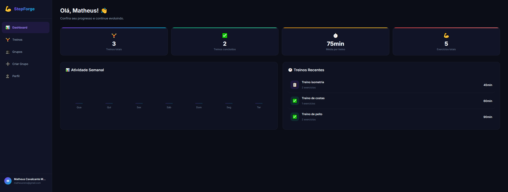
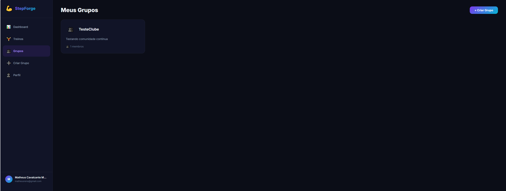
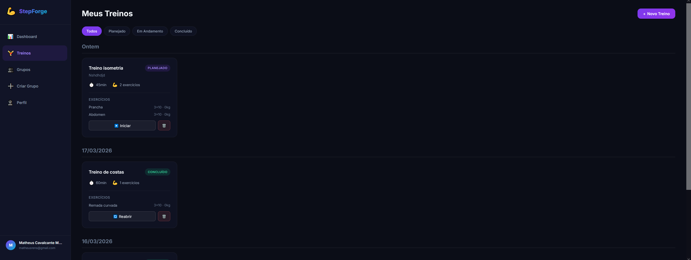
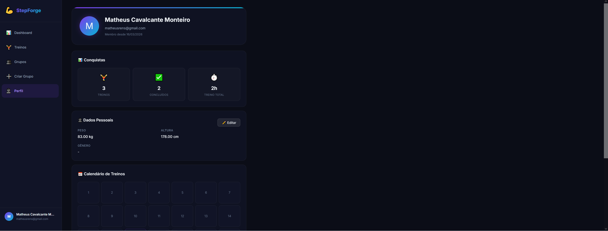

# 💪 StepForge

<p align="center">
  
  
  
  
  
</p>

**StepForge** é uma plataforma completa de fitness e socialização, projetada para conectar atletas e entusiastas da musculação. O projeto utiliza uma arquitetura de monorepo moderna, entregando uma experiência nativa em Android, uma aplicação Web Progressiva (PWA) e um backend robusto e escalável.

---

## 🎯 Por que o StepForge?

Este projeto foi desenvolvido com foco em resolver o problema de motivação em rotinas de treino através da gamificação e interação social. Ele demonstra competência em:
- **Frontend Multiplataforma**: Reuso de lógica e tipos entre Web e Mobile.
- **Backend Escalável**: Arquitetura modular com NestJS.
- **Experiência do Usuário**: Interface PWA otimizada para dispositivos móveis.

---

## ✨ Funcionalidades Principais

| Recurso | Descrição |
| :--- | :--- |
| **🏠 Dashboard** | Visão geral de progresso, estatísticas e atividades recentes. |
| **👥 Grupos Sociais** | Crie ou participe de grupos de treino, interaja com membros e veja rankings. |
| **📸 Check-ins Sociais** | Registre seus treinos com fotos e compartilhe o progresso com a comunidade. |
| **📅 Calendário de Treinos** | Acompanhe sua frequência e planeje sua semana de exercícios. |
| **💬 Interatividade** | Sistema de comentários e curtidas em posts de check-in. |
| **🔐 Autenticação JWT** | Segurança de ponta a ponta para os dados do usuário. |

---

## 🛠️ Stack Tecnológica

### Monorepo Architecture
O projeto utiliza **npm workspaces** para gerenciar as dependências de forma centralizada:

- **Frontend Mobile**: React Native (Android Nativo)
- **Frontend Web**: React + Vite (PWA de alto desempenho)
- **Backend**: NestJS + TypeORM/Prisma
- **Banco de Dados**: PostgreSQL
- **Shared**: Tipagem TypeScript compartilhada entre todos os serviços

---

## 📸 Demonstração

> [!NOTE]
> *As capturas de tela abaixo mostram a interface do StepForge em ação.*

<div align="center">
  <table>
    <tr>
      <td align="center"><b>Dashboard</b></td>
      <td align="center"><b>Grupos Social</b></td>
    </tr>
    <tr>
      <td></td>
      <td></td>
    </tr>
    <tr>
      <td align="center"><b>Diário de Treinos</b></td>
      <td align="center"><b>Perfil e Conquistas</b></td>
    </tr>
    <tr>
      <td></td>
      <td></td>
    </tr>
  </table>
</div>

---

## 🚀 Como Executar o Projeto

### Pré-requisitos
- Node.js >= 18
- PostgreSQL 14+
- Docker (Opcional, mas recomendado para o banco)

### Configuração Inicial
1. Clone o repositório:
```bash
git clone https://github.com/SEU-USUARIO/stepforge.git
cd stepforge
```

2. Instale as dependências globais:
```bash
npm install
```

3. Configure o `.env` do backend:
```bash
cp backend/.env.example backend/.env
```

### Rodando em Desenvolvimento
O projeto possui scripts facilitados no `package.json` raiz:

```bash
# Iniciar o Backend
npm run dev:backend

# Iniciar a Web (PWA)
npm run dev:web

# Iniciar o Mobile (Metro Bundler)
npm run dev:mobile
```

---

## 🧠 Desafios Técnicos & Aprendizados

Neste projeto, apliquei conceitos avançados como:
- **DRY (Don't Repeat Yourself)**: Através da pasta `shared`, onde centralizei as interfaces e DTOs, garantindo que o backend e o frontend falem "a mesma língua".
- **Mobile First**: Design responsivo no PWA para que a experiência seja idêntica a um app nativo no iOS.
- **SQL Complexo**: Queries otimizadas para gerar o ranking de membros nos grupos de treino.

---

## 📄 Licença

Distribuído sob a licença MIT. Veja `LICENSE` para mais detalhes.

---
<p align="center">
  Desenvolvido por <b>Matheus</b> - <a href="https://github.com/SEU-USUARIO">GitHub</a> • <a href="https://linkedin.com/in/SEU-LINKEDIN">LinkedIn</a>
</p>
