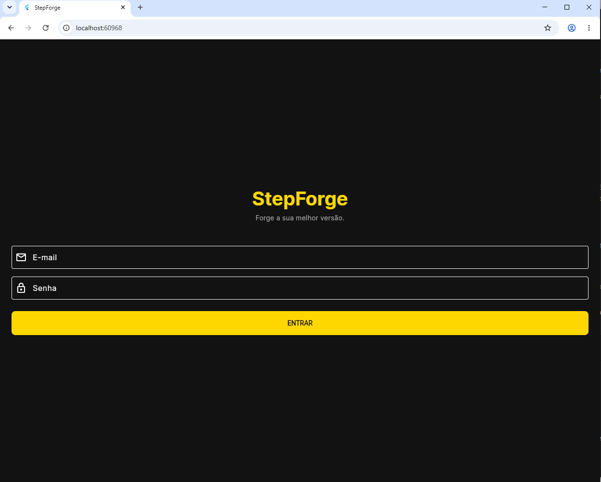
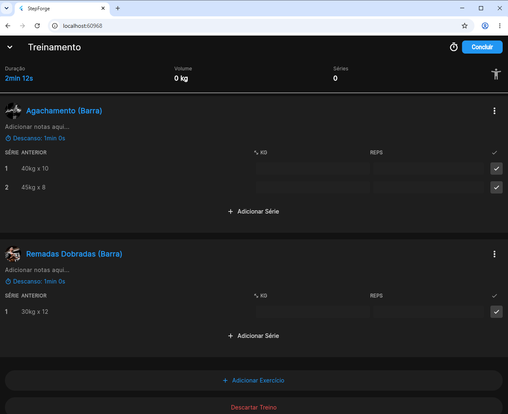
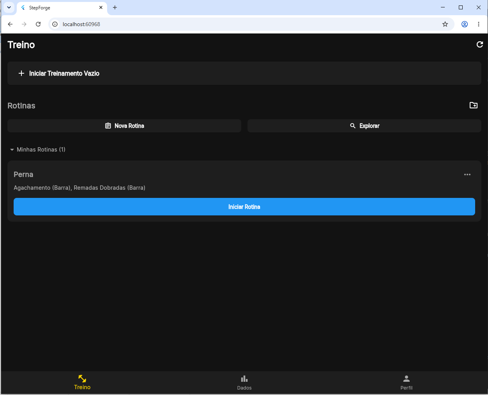
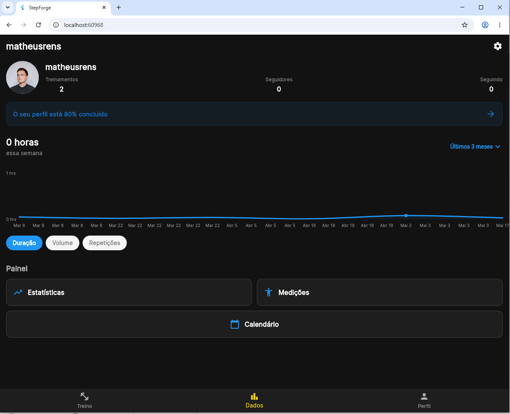

# StepForge 🏋️‍♂️⚔️

> [!WARNING]
> **🚧 Projeto em Desenvolvimento (Work in Progress)**
> Este aplicativo ainda está sendo construído. Algumas telas e funcionalidades podem estar incompletas ou em fase de testes.

Um aplicativo inovador de acompanhamento de treinos que mistura a rotina de exercícios com elementos de gamificação e estatísticas de RPG! Acompanhe seu progresso de forma visual e intuitiva com gráficos de radar e gerencie suas rotinas de treinamento.

## 🌟 Funcionalidades

- **Gerenciamento de Treinos:** Crie, edite e acompanhe suas rotinas de exercícios diários.
- **Treino Ativo:** Interface focada durante a execução do seu treino para marcação de séries e progresso.
- **Estatísticas em Radar (RPG):** Visualize seus pontos fortes e evolução física como se fossem atributos de um personagem de jogo.
- **Autenticação:** Sistema de login seguro para manter seus dados salvos.
- **Perfil do Usuário:** Gerenciamento das suas preferências e acompanhamento de dados.

## 📸 Capturas de Tela

### Tela de Login


### Rotina de Treinamento


### Tela de Treino Ativo


### Gráfico de Evolução e Estatísticas


## 🚀 Como Executar

Para rodar o projeto localmente, certifique-se de ter o Flutter instalado na sua máquina.

1. Clone o repositório
```bash
git clone https://github.com/matheusmonteiro15/StepForge.git
```
2. Baixe as dependências
```bash
flutter pub get
```
3. Execute o app
```bash
flutter run
```

## 🛠️ Tecnologias Utilizadas

- [Flutter](https://flutter.dev/) - Framework de UI multiplataforma.
- [Dart](https://dart.dev/) - Linguagem de programação principal.
- [Provider/Riverpod] - Gerenciamento de Estado focado em escalabilidade.

## 📝 Licença

Este projeto tem código aberto e está disponível para uso pessoal e exibição no portfólio.
